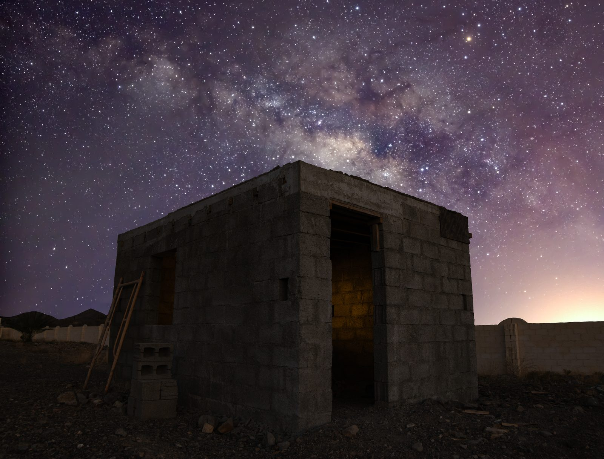
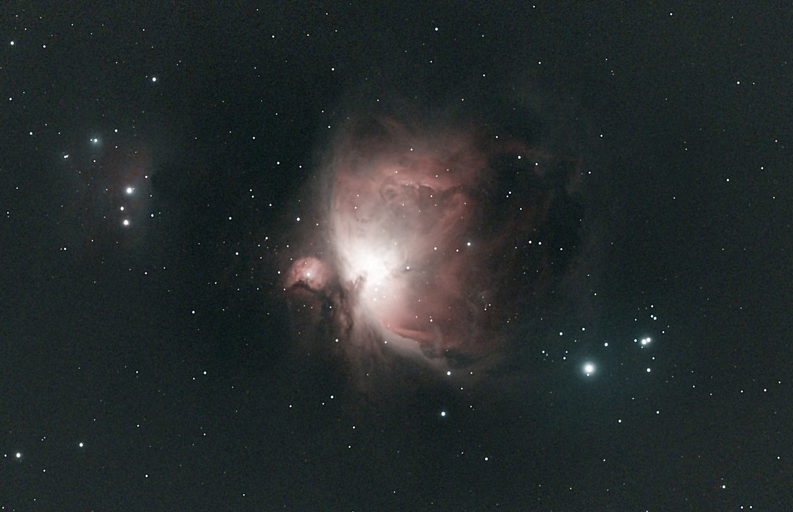
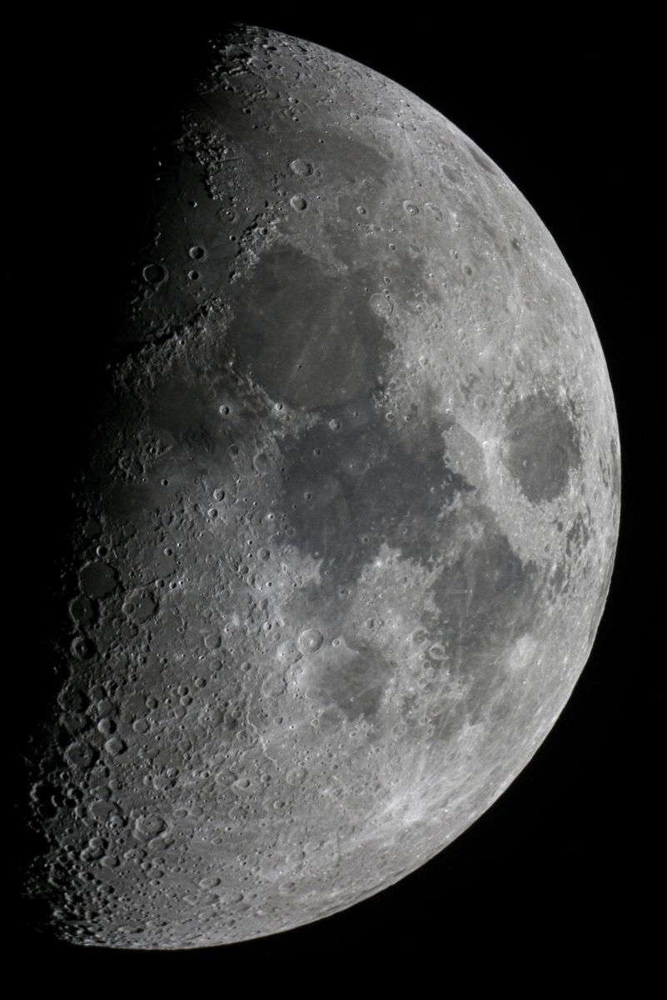

<!-- ═══════════════════════════════════════════════════════════════════════
      AHMED AL-KHALDI  ·  COSMIC DATA OBSERVATORY
      Repo: AhmedTheNetCoder/AhmedTheNetCoder  →  renders on your profile
═══════════════════════════════════════════════════════════════════════ -->

<!-- ░░░░░░░░░░ HERO / BANNER ░░░░░░░░░░ -->
<p align="center">
  
</p>

<!-- ░░░░░░░░░░ LIVE TRANSMISSION (typing) ░░░░░░░░░░ -->
<p align="center">
  <a href="https://github.com/AhmedTheNetCoder">
    
  </a>
</p>

<p align="center">
  
  &nbsp;
  
  &nbsp;
  
</p>

<!-- ░░░░░░░░░░ OBSERVATORY CONTROL PANEL (nav) ░░░░░░░░░░ -->
<p align="center">
  <a href="#-first-contact"></a>
  <a href="#-instrumentation--optics"></a>
  <a href="#-signal-processing-lab"></a>
  <a href="#-long-exposure-gallery"></a>
  <a href="#-observatory-telemetry"></a>
  <a href="#-open-a-channel"></a>
</p>


<!-- ░░░░░░░░░░ FIRST CONTACT (intro) ░░░░░░░░░░ -->
## 🛰️ First Contact

<table>
<tr>
<td width="62%" valign="top">

```yaml
observer:      Ahmed Al-Khaldi
callsign:      AhmedTheNetCoder
role:          Data Analyst / Power BI Developer
mission:       make messy data readable at a glance
instruments:   Power BI · Python · SQL · DAX · Power Query
also_captures: photons — long-exposure & astrophotography
philosophy:    "A good dashboard is a telescope for decisions."
coffee_level:  ████████░░  refuel imminent ☕
```

I run a small **data observatory**: I point analytical instruments at raw,
noisy datasets and pull out the *signal* — the story a decision-maker can act
on in five seconds. By night I swap the semantic model for a camera and collect
a different kind of light.

> **Two disciplines, one skill:** framing chaos into something worth looking at —
> whether the subject is a revenue trend or a distant nebula.

</td>
<td width="38%" valign="top">


<div align="center">
  
  
  
</div>

</td>
</tr>
</table>


<!-- ░░░░░░░░░░ INSTRUMENTATION (skills) ░░░░░░░░░░ -->
## 🔭 Instrumentation &amp; Optics

> The array of instruments I use to capture, clean, and focus data.

<div align="center">

**◍ Full toolbelt at a glance**

<a href="#-instrumentation--optics">
  
</a>

<br/><br/>

**◍ Primary Mirror — Business Intelligence**


**◍ Light Collectors — Languages &amp; Data**


**◍ Control Systems — Frontend &amp; Tools**


**◍ Darkroom — Creative &amp; Capture**


</div>


<!-- ░░░░░░░░░░ SIGNAL PROCESSING LAB (data/BI) ░░░░░░░░░░ -->
## 📡 Signal Processing Lab

> Where raw noise becomes a decision. My core discipline.

```text
  RAW DATA  ──▶  CLEAN (Power Query)  ──▶  MODEL (star schema + DAX)  ──▶  📊 INSIGHT
   ▓░▓▒░▓▒        ░░░░░░░░░░░              ◇──◇──◇──◇                    ▁▃▅▇█▇▅▃▁
   noisy          normalised              relationships                 signal
```

<table>
<tr>
<td width="33%" valign="top" align="center">

**🧮 Modelling**

Star schemas, DAX measures,
time-intelligence, calculation
groups & RLS security.

</td>
<td width="33%" valign="top" align="center">

**⚙️ Automation**

Power Query pipelines &
Python scripts that kill
the manual copy-paste loop.

</td>
<td width="33%" valign="top" align="center">

**🎨 Data Storytelling**

Dashboards designed like
UI — hierarchy, restraint,
one glance to the answer.

</td>
</tr>
</table>

<div align="center">
  
</div>


<!-- ░░░░░░░░░░ LONG-EXPOSURE GALLERY (photography) ░░░░░░░░░░ -->
## 📷 Long-Exposure Gallery

> The other kind of light collection. Swap the semantic model for a shutter.

<table>
<tr>
<td align="center" width="40%">
  
  <br/><sub>🌌 Milky Way core · Oman desert · wide-field</sub>
</td>
<td align="center" width="30%">
  
  <br/><sub>🔴 Orion Nebula (M42) · deep-sky</sub>
</td>
<td align="center" width="30%">
  
  <br/><sub>🌓 First-quarter Moon · the terminator</sub>
</td>
</tr>
</table>

> 🌌 *Same instinct as my dashboards: control the exposure, remove the noise,
> let the subject speak.*


<!-- ░░░░░░░░░░ OBSERVATORY TELEMETRY (stats) ░░░░░░░░░░ -->
## 📊 Observatory Telemetry

<div align="center">

<!-- Animated 3D contribution calendar — regenerated daily by .github/workflows/3d-contrib.yml -->


<br/><br/>


<!-- Contribution snake — theme-aware, regenerated by .github/workflows/snake.yml -->
<picture>
  <source media="(prefers-color-scheme: dark)" srcset="https://raw.githubusercontent.com/AhmedTheNetCoder/AhmedTheNetCoder/output/snake-dark.svg"/>
  <source media="(prefers-color-scheme: light)" srcset="https://raw.githubusercontent.com/AhmedTheNetCoder/AhmedTheNetCoder/output/snake.svg"/>
  
</picture>

</div>


<!-- ░░░░░░░░░░ ACTIVE MISSIONS (goals) ░░░░░░░░░░ -->
## 🚀 Active Missions

```diff
+ [ONGOING]  Publish a public Power BI dashboard gallery
+ [ONGOING]  Deepen advanced DAX & data modelling patterns
~ [DOCKING]  Ship an end-to-end analytics automation pipeline
~ [DOCKING]  Blend astrophotography data with visual storytelling
- [LOCKED ]  ??? — decrypting next objective
```

<div align="center">
  
</div>


<!-- ░░░░░░░░░░ OPEN A CHANNEL (contact) ░░░░░░░░░░ -->
## 📶 Open a Channel

<div align="center">

> **Transmitting on all frequencies.** Dashboards, data problems, photo walks, or collabs — ping the observatory.

<a href="mailto:omanvibecoder@gmail.com">
  
</a>
<a href="https://github.com/AhmedTheNetCoder">
  
</a>
<br/>
<a href="https://www.linkedin.com/in/ahmed-al-khaldi-5079781b3/">
  
</a>
<a href="https://ahmedalkhaldi.vercel.app/">
  
</a>
<a href="#-long-exposure-gallery">
  
</a>

</div>

<br/>

<p align="center">
  <i>“We are just an advanced breed of monkeys on a minor planet of a very average star.
  But we can understand the Universe. That makes us something very special.” — Stephen Hawking</i>
</p>

<p align="center">
  
</p>
